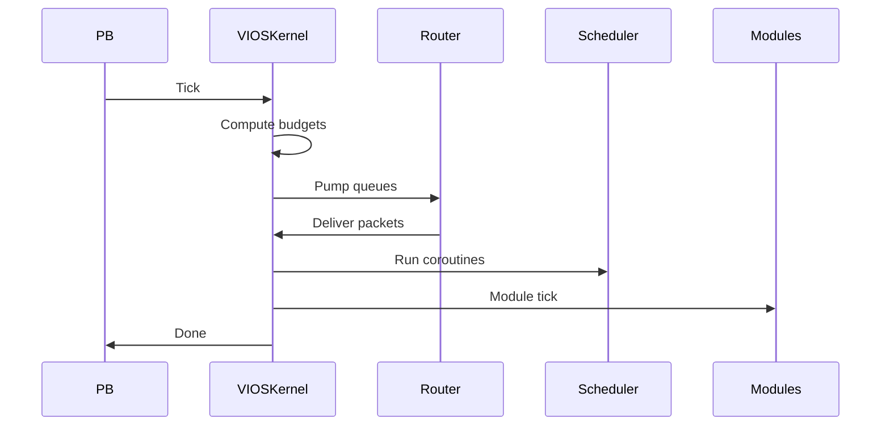
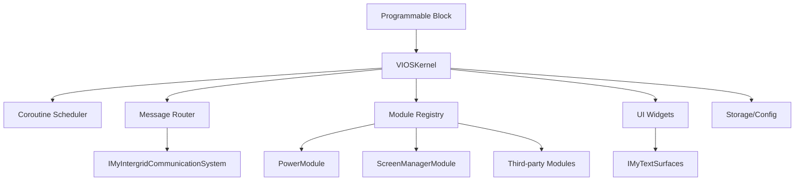
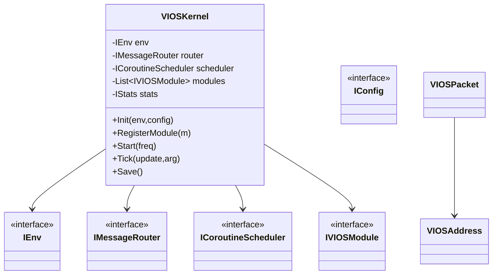
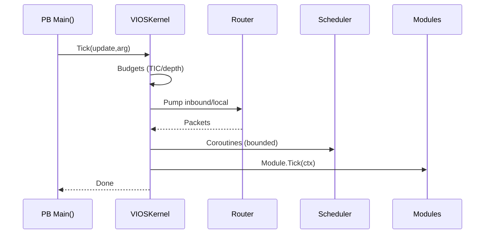
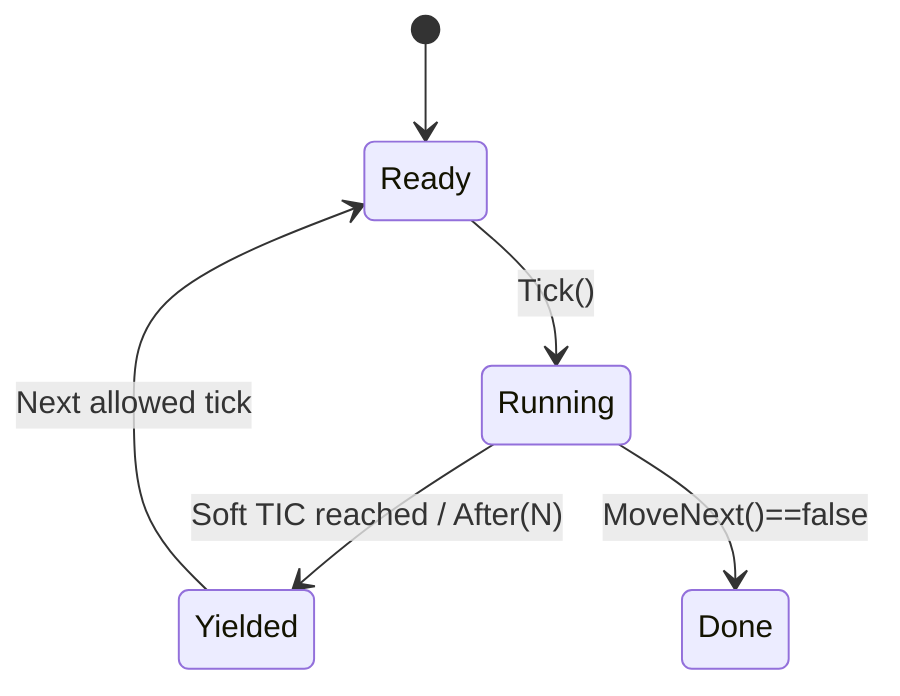

# VIOS Architecture

**Product:** Viking Industries Operating System (**VIOS**)
**Context:** Space Engineers Programmable Block • MDK²‑SE • VS Code
**Version:** v0.1.2 (adds Template Sync policy §2.1, dual verifiers + CI gate, scaffolding & LF/BOM notes; repo layout updated)

> This is the **canonical architecture reference** for contributors and Codex. It captures the complete scope: kernel, scheduler, router, UI, storage, pools, stats, modules, repository layout, and diagrams.

---

## 1. Mission, Non‑Goals, Principles

**Mission.** Provide a small, robust OS‑style framework running inside a single SE Programmable Block that offers:

- A **Kernel** with lifecycle orchestration and module registry.
- A **Coroutine Scheduler** to slice work across ticks under instruction/call‑depth budgets.
- A unified **Message/Event Router** for local + IGC traffic (unicast/multicast/broadcast).
- Basic **UI widgets** on LCDs with configurable layouts and cadence.
- **Persistence** via PB `Storage` and configuration via `Me.CustomData` (`MyIni`).
- A stable **Module API** so third parties can add features without forking core.

**Non‑Goals.** Heavy serialization, reflection, dynamic code loading, background threads, or anything outside the PB whitelist. Multiplayer state sync beyond best‑effort messaging is out of scope.

**Design Principles.** C# 6 / net48; VRage‑first APIs; deterministic ticks; cooperative concurrency; zero GC in hot paths; neutral module names; **VIOS uppercase** in type names containing the OS; variables may be `vios` lowercase.

---

## 2. MDK² Hard Constraints & Enclosure Rule

**PB Script projects (`mdk2pbscript`)** must declare the entry type like this:

```csharp
namespace IngameScript
{
    public partial class Program : MyGridProgram
    {
        // generated code here
    }
}
```

**Mixin projects (mdk2mixin):** must **not** redeclare visibility or base class; use:

```csharp
namespace IngameScript
{
    partial class Program
    {
        // mixin code here
    }
}
```

**Additional hard constraints**:

1. **Targets & Packages:** `netframework48`, `LangVersion=6`. PB script projects include `Mal.Mdk2.PbPackager`, `Mal.Mdk2.PbAnalyzers`, and `Mal.Mdk2.References`. Mixin projects include `PbAnalyzers` + `References` only.
2. **SE/MDK²-SE (VRage-first):** Favor _VRage_ APIs over general .NET where possible (e.g., `IMyTextSurface`, `MySprite`, `IMyIntergridCommunicationSystem`, `MyIni`).
3. **Safety:** Wrap the top-level PB driver (`Main()`/kernel dispatcher) in `try/catch`; echo concise errors and optionally display on a Debug LCD surface.
4. **Ticks & Budgets:** Track **TIC** (`Runtime.CurrentInstructionCount`) and **Call Depth** (`Runtime.CurrentCallChainDepth`) and **yield** at configurable thresholds (Soft/Hard TIC and MaxDepth read from `CustomData`).
5. **Coroutine‑First:** Use coroutine/state‑machine scheduling extensively to spread work across ticks; heavy scans must be sliced.
6. **Pooling/Queuing:** Reuse buffers/objects aggressively; provide central pools for messages/packets/sprites/strings; use bounded queues with drop‑oldest on overflow.
7. **Events/Messages:** Maintain a unified EventBus & MessageRouter for local (host/LAN) and inter‑grid (WAN via IGC) with unicast/multicast/broadcast.
8. **Time & Cycles:** Record UTC (`DateTime.UtcNow`) per tick and per event for diagnostics and scheduling.
9. **Mixins Layout:** Core lives under **Mixins/VIOS.Core**; PB scripts are thin bootstraps in **Scripts/**; user extensions live in **Mixins/Modules/** (neutral names) and **Mixins/Components/**.
10. **Naming:** **VIOS** must be uppercase in any class/interface/struct names containing the OS name; variables may use lowercase `vios`. **Modules/Components** keep **neutral** class names (no `VIOS` prefix) while implementing branded interfaces.
11. **UI Cadence:** LCD drawing is throttled (default `Update10`) and budget‑aware; avoid redundant `DrawFrame` work.
12. **Persistence & Config:** Use PB `Storage` for state and `Me.CustomData` (via `MyIni`) for configuration.
13. **Whitelist Compliance:** Use only PB‑allowed APIs; avoid LINQ/allocations in hot paths and any forbidden namespaces.

### 2.1 Template Sync & MDK² Invariants

The repo enforces project shape via **template sync** in two modes (RELAXED default, STRICT optional).  
See **docs/policies/VIOS-Template-Sync-Policy.md**.
For local checks see CONTRIBUTING.md → Template Sync (LOCAL).

- **Static files (exact match):** `.gitignore`, `.gitattributes`, `.editorconfig`, `Directory.Build.props`; PB `*.mdk.ini` must contain `type=programmableblock`.
- **Semi-static (schema strict):** `*.csproj` (exactly one per submodule).
  - **PB (`mdk2pbscript`):** must include `<Mdk2ProjectType>mdk2pbscript</Mdk2ProjectType>` and packages `Mal.Mdk2.PbPackager`, `Mal.Mdk2.PbAnalyzers`, `Mal.Mdk2.References`.
  - **Mixin (`mdk2mixin`):** must include `<Mdk2ProjectType>mdk2mixin</Mdk2ProjectType>`, **no** PbPackager; require `Mal.Mdk2.PbAnalyzers` + `Mal.Mdk2.References`.
- **Flexible code:** PB must declare `public partial class Program : MyGridProgram`; mixins require at least one `partial class Program` (no visibility/base), and **must not** inherit `MyGridProgram`.

**Verifiers**

- Bash: `tools/verify-templates-sync.sh`
- PowerShell: `tools/Verify-TemplatesSync.ps1`

RELAXED mode warns on `.csproj` drift (after ignoring XML comments and ProjectReference-only groups). STRICT mode fails on that drift.

### 2.2 Inherited build knobs

These TFM/LangVersion knobs are inherited via Directory.Build.props; do not set them in individual .csproj files.

---

## 3. Repository & Project Layout (MDK² — Detailed Canonical)

```
<root>/
├─ SE-VIOS-DevFramework.sln                  # Solution wiring PB + mixins (optional but recommended)
├─ Directory.Build.props                     # Enforce net48 + C#6 + IngameScript root namespace
├─ .editorconfig                             # Coding style (indentation, C#6 hints)
├─ .gitignore
├─ README.md                                 # CI badge + quick start
├─ LICENSE / NOTICE / TRADEMARK.md
│
├─ Scripts/                                  # mdk2pbscript (thin PB bootstraps you paste into SE)
│  ├─ VIOS.Bootstrap/
│  │  ├─ Program.cs                          # PB driver only – constructs kernel, registers modules
│  │  └─ VIOS.Bootstrap.csproj               # Includes PbPackager + Analyzers + References
│  └─ VIOS.DevSandbox/ (optional)
│     └─ VIOS.DevSandbox.csproj
│
├─ Mixins/                                   # mdk2mixin (reusable source merged into PB at build)
│  ├─ VIOS.Core/                             # Branded core types only
│  │  ├─ VIOS.Core.csproj                    # Analyzers + References (no packager)
│  │  ├─ VIOS.cs                             # Kernel + composition root
│  │  ├─ Env.cs                              # PB environment adapter
│  │  ├─ Scheduler.cs                        # Coroutine scheduler
│  │  ├─ Messaging.cs                        # Address/Packet/Router
│  │  ├─ Events.cs                           # Event bus primitives (optional split)
│  │  ├─ Pools.cs                            # Pools & queues
│  │  ├─ Storage.cs                          # MyIni + Storage helpers
│  │  ├─ Modules.cs                          # Module registrar + lifecycles
│  │  ├─ Stats.cs                            # Counters
│  │  └─ UI/
│  │     ├─ Console.cs                       # Text console abstraction
│  │     └─ Widgets.cs                       # Spinner, progress, tables, charts
│  │
│  ├─ Components/                            # Neutral building blocks (each as its own mixin)
│  │  ├─ Discovery/
│  │  │  └─ Discovery.csproj                 # Grid scan helpers, block finders (VRage-first)
│  │  ├─ Screen/
│  │  │  └─ ScreenPrimitives.csproj          # Draw helpers (glyph layout, column calc)
│  │  └─ Network/
│  │     └─ LightNameService.csproj          # Best-effort discovery + name registry
│  │
│  └─ Modules/                               # Neutral feature modules (each as its own mixin)
│     ├─ Power/
│     │  ├─ PowerModule.csproj
│     │  └─ PowerModule.cs
│     ├─ ScreenMgr/
│     │  ├─ ScreenManagerModule.csproj
│     │  └─ ScreenManagerModule.cs
│     └─ (Airlock|Cargo|Production)/...
│
├─ ThirdParty/                               # Optional vendor mixins (git submodules)
│  └─ <Vendor>.<Module>/
│     └─ <Vendor>.<Module>.csproj
│
├─ docs/
│  ├─ architecture/
│  │  └─ VIOS-Architecture.md                # Canonical architecture (this file)
│  ├─ prompts/
│  │  └─ VIOS-Prompt-Reusable.md             # New-chat template for Codex/GPT
│  ├─ policies/
│  │  └─ VIOS-Branding-Extension-Policy.md
│  └─ steam/
│     └─ Workshop-Description.md
│
├─ codex/
│  ├─ tasks/                                 # Seed tasks T-001…T-004 for Codex sessions
│  └─ checklists/
│     └─ PR-acceptance.md
│
├─ tools/
│  ├─ license_header.tmpl                    # Single-source header template
│  ├─ add_license_header.sh                  # Bash stamper (reads the template)
│  ├─ Add-LicenseHeader.ps1                  # PowerShell stamper (reads the template)
│  ├─ check-architecture.ps1                 # CI guardrails (TFM/LangVersion/naming/enclosure)
│  ├─ verify-templates-sync.sh               # Bash verifier (RELAXED/STRICT)
│  ├─ Verify-TemplatesSync.ps1               # PowerShell verifier (RELAXED/STRICT)
│  ├─ scaffold-submodule.sh                  # Submodule scaffolder (pbscript/mixin)
│  └─ Scaffold-Submodule.ps1                 # Windows variant
│
├─ .githooks/
│  ├─ pre-commit                             # Calls stampers; re-stages changed files
│  └─ pre-commit.ps1
│
└─ .github/
   ├─ workflows/
   │  ├─ ci.yml                              # Build + checks + PR review comments + PR checklist gate
   │  ├─ docs-validate.yml                   # Docs lint & link checks (Markdown/anchors/TOC; Prettier/markdownlint)
   │  └─ verify-templates-sync.yml           # Template sync pre-merge job
   ├─ ISSUE_TEMPLATE/
   │  ├─ bug_report.yml                      # Bug template
   │  └─ module_proposal.yml                 # Module proposal template
   ├─ pull_request_template.md               # Synced with CONTRIBUTING checklist
   └─ CODEOWNERS
```

### 3.1 Project Types & Wiring (recap)

- **PB scripts** under `Scripts/` are **`mdk2pbscript`** and include `PbPackager` + `PbAnalyzers` + `References`.
- **Core/Modules/Components** under `Mixins/` are **`mdk2mixin`** and include `PbAnalyzers` + `References` only.
- PB scripts **reference** mixins via `<ProjectReference/>`; the packager merges sources into the final PB output.

### 3.2 Dependency Rules

- `Scripts/*` → may reference: `Mixins/VIOS.Core`, any `Mixins/Modules/*`, any `Mixins/Components/*`.
- `Mixins/VIOS.Core` → may reference: specific `Components` (avoid cyclic deps); **must not** reference modules.
- `Mixins/Modules/*` → may reference: `VIOS.Core` and **specific** `Components` they need; **must not** reference other modules directly (communicate via router/events).
- `Mixins/Components/*` → must be leaf libraries (no references to modules); can be reused by core or modules.

### 3.3 Branding & Naming in Layout

- Only **Core** uses the **VIOS** brand in type names; `Mixins/VIOS.Core` project name is acceptable.
- **Modules/Components** use **neutral** project and type names (e.g., `PowerModule`, `ScreenManagerModule`).

### 3.4 Build & CI Assumptions

- Solution file lists the PB + mixins projects; CI builds the solution with MSBuild in **Release**.
- `tools/check-architecture.ps1` is the single source for policy checks (enclosure, net48/C#6, headers, naming, PB whitelist hints).

### 3.5 Scaffolding & Naming

Use the scaffolding helpers to add PB scripts or mixins:

- Linux/macOS: `tools/scaffold-submodule.sh pbscript|mixin <path> <remote> <ProjectName> [--sln <sln>]`
- Windows: `tools/Scaffold-Submodule.ps1 ...` (same parameters)

The scaffolder:

- Adds the submodule and copies template infra (`.gitignore`, `.gitattributes`, `.editorconfig`, `Directory.Build.props`).
- Creates the appropriate `__NAME__.csproj` with `<Mdk2ProjectType>`.
- For PB scripts, creates the minimal `Program.cs` and `${Project}.mdk.ini` with `type=programmableblock`.

**Naming**

- PB script project files typically match the folder (e.g., `VIOS.Minimal.csproj`) but the verifiers tolerate any single `*.csproj` per folder.
- Modules and Components must use **neutral** class names (no `VIOS` prefix) but implement branded interfaces from **VIOS.Core**.

### 3.6 Line Endings, BOM, and Prettier

Verifiers normalize **LF/CRLF** and ignore UTF-8 BOMs. They also ignore XML comments and pure ProjectReference groups when comparing `*.csproj`.  
Markdown is formatted with Prettier; dash (-) bullets are preferred and may be auto-rewritten on save.

---

## 4. Layered Overview & Responsibilities

- **VIOSKernel** (branded)

  - Orchestrates lifecycle: `Init → Register → Start → Tick → Save`.
  - Owns singletons: **CoroutineScheduler**, **MessageRouter**, **ModuleRegistry**, **Stats**, **Console/UI**, **Config**.
  - Computes budgets per tick and enforces them across subsystems.

- **CoroutineScheduler**

  - Cooperative, allocation‑free once running.
  - Enforces **TIC soft/hard** and **MaxCallDepth**; offers `Start/Stop/Tick`.

- **Message Router**

  - Local event queue + IGC adapter.
  - Simple addressing (`VIOSAddress`) and **packet** (`VIOSPacket`) with endpoint string + compact payload.
  - Unicast/multicast/broadcast; bounded queues with drop‑oldest semantics.

- **UI Subsystem**

  - Renders header/footer/status and basic widgets on one or more LCD surfaces.
  - **ScreenMgr** module coordinates surfaces & cadence; core provides drawing primitives.

- **Persistence/Config**

  - `MyIni` over `Me.CustomData` for config.
  - PB `Storage` for compact state strings.

- **Modules & Components**

  - **Modules:** neutral class names implementing `IVIOSModule` (e.g., Power, ScreenMgr).
  - **Components:** small neutral building blocks (discovery, naming, screen primitives) consumed by core/modules.

See `.github/workflows/verify-templates-sync.yml` for the pre-merge template sync gate (RELAXED by default; set `MODE: STRICT` to hard-fail on semi-static drift).

---

## 5. Core Types (interfaces)

> All inside `IngameScript.Program`.

```csharp
using System; using System.Text; using System.Collections.Generic;
using Sandbox.ModAPI.Ingame; using VRage.Game; using VRage.Game.GUI.TextPanel;

namespace IngameScript { partial class Program {

  // Context passed to modules & subsystems
  struct VIOSContext {
    public IEnv Env; public IConfig Config; public IStats Stats;
    public IMessageRouter Router; public ICoroutineScheduler Scheduler;
  }

  interface IVIOSKernel { void Init(IEnv env, IConfig cfg); void RegisterModule(IVIOSModule m);
    void Start(UpdateFrequency f); void Tick(UpdateType u, string arg); void Save(); }

  interface IVIOSModule {
    string Name { get; }
    void Init(VIOSContext ctx, IModuleRegistrar reg);
    void Start(VIOSContext ctx);
    void Tick(VIOSContext ctx);
    void Stop(VIOSContext ctx);
    void OnMessage(ref VIOSPacket p, VIOSContext ctx);
    void DescribeStatus(StringBuilder sb);
  }

  interface IModuleRegistrar { void Subscribe(string endpoint, IMessageHandler h); void SubscribeIGC(string endpoint, IMessageHandler h); }
  interface IMessageHandler { void Handle(ref VIOSPacket p, VIOSContext ctx); }

  // Messaging
  struct VIOSAddress { public long Id; public byte Scope; /*0=host,1=LAN,2=WAN*/ }
  struct VIOSPacket { public VIOSAddress To, From; public string Endpoint; public string Payload; public int Flags; }

  interface IMessageRouter {
    void Configure(string tag); // IGC tag
    void EnqueueLocal(ref VIOSPacket p);
    void EnqueueOutbound(ref VIOSPacket p);
    bool TryDequeueLocal(out VIOSPacket p);
    bool TryDequeueInbound(out VIOSPacket p);
    void Pump(VIOSContext ctx, int budgetInstructions);
  }

  // Scheduler
  struct CoroutineId { public int Value; }
  interface ICoroutine { bool MoveNext(); }
  interface ICoroutineScheduler {
    CoroutineId Start(ICoroutine c); void Stop(CoroutineId id);
    void Tick(VIOSContext ctx, int softBudget, int hardBudget, int maxDepth);
    int ActiveCount { get; }
  }

  // Environment & config
  interface IEnv { IMyProgrammableBlock Me { get; } IMyGridProgramRuntimeInfo Runtime { get; }
    IMyGridTerminalSystem GTS { get; } IMyIntergridCommunicationSystem IGC { get; }
    Action<string> Echo { get; } DateTime UtcNow { get; } IMyTextSurface DebugSurface { get; } }

  interface IConfig { bool TryGet(string s, string k, out string v);
    int GetInt(string s, string k, int d); bool GetBool(string s, string k, bool d);
    string GetString(string s, string k, string d); }

  interface IStats { int LastTic; int MaxTic; int LastDepth; int MaxDepth; int MsgIn; int MsgOut; int Dropped; int Coroutines; int Yields; }

}} // ns/class
```

---

## 6. Kernel Lifecycle & Tick Pipeline

**Init**

- Capture `IEnv`, create `IConfig` (MyIni), construct **Router**, **Scheduler**, **Stats**, **Console/UI**.
- Prepare **ModuleRegistry** and pass a `VIOSContext` to each `Init`.

**Register**

- Modules subscribe to message endpoints via `IModuleRegistrar`.
- Parse `CustomData` for module‑specific config; enqueue heavy discovery as coroutines.

**Start**

- Kernel sets `Runtime.UpdateFrequency` (default `Update10 | Update100`).
- Subscribes to IGC with selected tag (default `VIOS`).

**Tick(update, arg)**

1. Capture **UTC**, **TIC**, **Depth**; compute **Soft/Hard budgets** and **MaxDepth**.
2. `Router.Pump` to drain inbound IGC, then local queue (bounded).
3. `Scheduler.Tick` until soft budget; never exceed hard budget.
4. `Module.Tick` (lightweight only; long work belongs to coroutines).
5. Every N ticks (e.g., Update100), write Echo + optional Debug LCD status (`Stats`, UTC, modules).
6. If exception: catch at PB driver, surface message, and attempt graceful recovery.

**Save**

- Ask modules to write compact state strings; persist to PB `Storage`.

### Sequence (Mermaid)



---

## 7. Scheduler Design & API

**Goals.** Slice any long scan/work across ticks; avoid exceeding TIC/hard; keep call chain depth low; zero allocations in steady state.

**Model.** A coroutine is any `ICoroutine` with `bool MoveNext()`. It holds its own localized state (e.g., index pointers, counters, next‑run tick). A scheduler ticks a ring buffer/list of active coroutines, removing finished ones and bailing when budgets are reached.

**Yield patterns (C# 6‑friendly).** Without `async/await`, encode yields as integer tick targets and return `true/false` from `MoveNext()`:

- **Yield.Now**: run again in the same tick (rare; only small steps).
- **Yield.NextTick**: set `nextRunTick = currentTick + 1`.
- **Yield.After(N)**: set `nextRunTick += N` to back‑off.

**Budgeting.**

- Stop the loop when `Runtime.CurrentInstructionCount >= SoftTicBudget` or `CurrentCallChainDepth >= MaxDepth`.
- Hard cap never crossed; if close, skip the rest, reschedule next tick.

**Stats.** Maintain counters: active coroutines, ran this tick, yields, time‑sliced tasks. Report on status line.

---

## 8. Messaging & Events

**Addressing.**

- `VIOSAddress.Scope`: `0=host`, `1=LAN` (connected grids), `2=WAN` (separate grids / IGC).
- `VIOSAddress.Id`: long identifier (Me.EntityId or computed).

**Packet.** `VIOSPacket` has `To`, `From`, `Endpoint` (`vendor.module.endpoint`), `Payload` (compact text), `Flags`.

**Queues.** Two in core: **Inbound** (IGC + local) and **Outbound** (to IGC). Both bounded. On overflow: **drop‑oldest** and increment `Stats.Dropped`.

**Dispatch.**

- Local: deliver to registered handlers by endpoint string match (exact or prefix for multicast).
- IGC: subscribe by tag; incoming `MyIGCMessage` converted to `VIOSPacket`; outgoing built to string.

**Payload formats.** Favor INI‑style or `key=value;` delimited strings. Avoid JSON/XML.

**Examples.**

- Query: `Power.Status?` → reply `Power.Status! stored=3.20,max=4.00,in=0.40,out=1.10`.
- Broadcast discovery: `NameSvc.Announce name=Driller-1,host=123456`.

---

## 9. Pools, Queues, and Memory Policy

- Maintain object pools for packet wrappers and reusable `StringBuilder` per module.
- Pre‑size `List<T>` and ring buffers; avoid `Add` growth in steady state.
- Queue policies: bounded capacity (configurable); on overflow drop oldest (not newest) to keep system responsive.

---

## 10. UI Subsystem

**Surfaces.**

- Default: PB LCD (surface index 0).
- Configurable list in `CustomData`: `PB:0`, block names with surface indices, or group names.

**Widgets.**

- **Header:** grid name, block name, UTC, OS label `VIOS`.
- **Footer:** status text + counters (TIC, coroutines, messages, dropped).
- **Spinner:** simple 4‑state spinner.
- **Progress:** min/max bar for tasks.
- **List/Table:** left‑aligned columns using monospaced font (Debug).
- **2D Chart:** coarse sparkline line/columns using sprites.

**Cadence.** Draw at `Update10` by default (configurable: `Update1/10/100`). ScreenMgr coalesces updates.

---

## 11. Configuration & Persistence

**Config (MyIni in CustomData).**

```ini
[VIOS]
UpdateFrequency=Update10,Update100
TIC.Soft=30000
TIC.Hard=45000
Depth.Max=50
Network.Tag=VIOS

[Modules]
Enable=Power,ScreenMgr

[ScreenMgr]
Surfaces=PB:0
Draw.Cadence=Update10
```

**State (Storage).**

- Kernel/state summary + module compact state strings. Keep small to avoid storage bloat.
- On `Program()` construction, parse `Storage` and rebuild minimal state; schedule heavy discovery later.

---

## 12. Module API, Registry & Lifecycles

**Neutral class names** implementing `IVIOSModule`.
**Lifecycle**

1. `Init(ctx, reg)`: subscribe endpoints; parse config; enqueue discovery coroutines.
2. `Start(ctx)`: reset counters; warm caches.
3. `Tick(ctx)`: cheap updates; all heavy loops via scheduler.
4. `Stop(ctx)`: release pools, clear lists.
5. `OnMessage(ref p, ctx)`: stateless and cheap; defer heavy replies to coroutines if needed.

**Status.** Each module implements `DescribeStatus(StringBuilder sb)` for ScreenMgr / Console.

---

## 13. Starter Modules (Power, ScreenMgr)

**PowerModule**

- Cache lists of `IMyBatteryBlock`, `IMyReactor`, `IMySolarPanel`, `IMyHydrogenEngine`.
- On `Tick`: recompute aggregates (`stored`, `max`, `in`, `out`) without allocations.
- Endpoint `Power.Status?` → reply `Power.Status!` with compact line.

**ScreenManagerModule**

- Parse `[ScreenMgr]` surfaces and cadence; draw header/UTC/footer; include stats line.
- Use `MySpriteDrawFrame` and Debug font for crisp text; avoid per‑tick allocations.

---

## 14. Safety, Budgets, and Fallbacks

- **Soft TIC** default 30000; **Hard TIC** 45000; **MaxDepth** 50.
- Kernel must **bail early** when soft reached; never cross hard.
- If an exception occurs in a module handler, catch/log locally and continue; do not take down the kernel.

---

## 15. Branding & Third‑Party Extensions

- **Core** types use uppercase **VIOS** in class/interface/struct names (`VIOSKernel`, `IVIOSModule`, `VIOSPacket`, `VIOSContext`).
- **Modules/Components**: neutral class names; compatible via branded interfaces.
- Third‑party mixins live under `ThirdParty/` (git submodules).
- IGC tag is configurable; default `VIOS`.

---

## 16. Diagrams (Mermaid)

### Layered Overview



### Class Diagram (Key Types)



### Tick Sequence



### Coroutine State Machine



---

## 17. Appendix: Minimal PB Bootstrap

```csharp
// Enclosure rule: all code inside IngameScript.Program
namespace IngameScript
{
  public partial class Program : MyGridProgram
  {
    IVIOSKernel _kernel; IEnv _env; IConfig _cfg;

    public Program()
    {
      _env = new Env(this);
      _cfg = new IniConfig(this);
      _kernel = new VIOSKernel();
      _kernel.Init(_env, _cfg);
      _kernel.RegisterModule(new PowerModule());
      _kernel.RegisterModule(new ScreenManagerModule());
      _kernel.Start(UpdateFrequency.Update10 | UpdateFrequency.Update100);
    }

    public void Save() { _kernel.Save(); }

    public void Main(string argument, UpdateType updateSource)
    {
      try { _kernel.Tick(updateSource, argument); }
      catch (System.Exception ex) { Echo("VIOS ERROR: " + ex.Message); }
    }
  }
}
```

---

## 18. Implementation Notes & Checklists

**Quality Gates**

- C# 6 only; PB whitelist safe.
- All code inside `IngameScript.Program`.
- Zero allocations in steady‑state tick paths.
- Enforce `TIC`/`Depth` budgets; bail on soft; never cross hard.
- Neutral module names; branded **VIOS** in type names where applicable.
- LCD drawing at configured cadence; avoid redundant `DrawFrame` work.

**CI Hooks**

- `tools/check-architecture.ps1` checks TFM/LangVersion, headers, enclosure, naming, and warns on LINQ.
- PR workflow posts inline comments for violations; PR template includes acceptance checklist.

**Next Steps**

- Fill `Mixins/VIOS.Core/*.cs` with skeletons per this spec.
- Finalize `ScreenMgr` + `Power` modules and add a breadcrumb LCD to prove end‑to‑end routing + scheduler.
