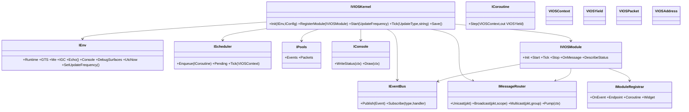
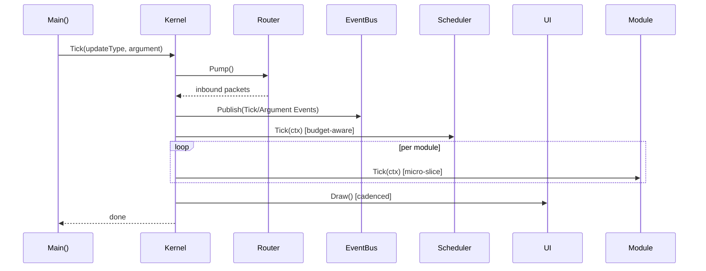
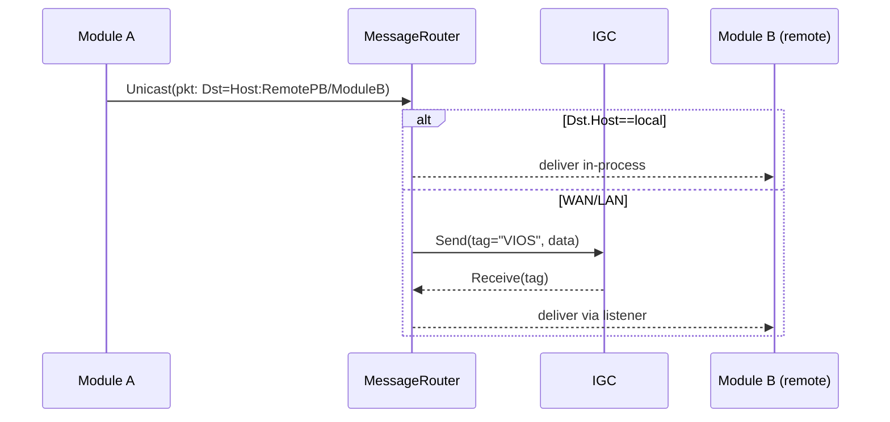
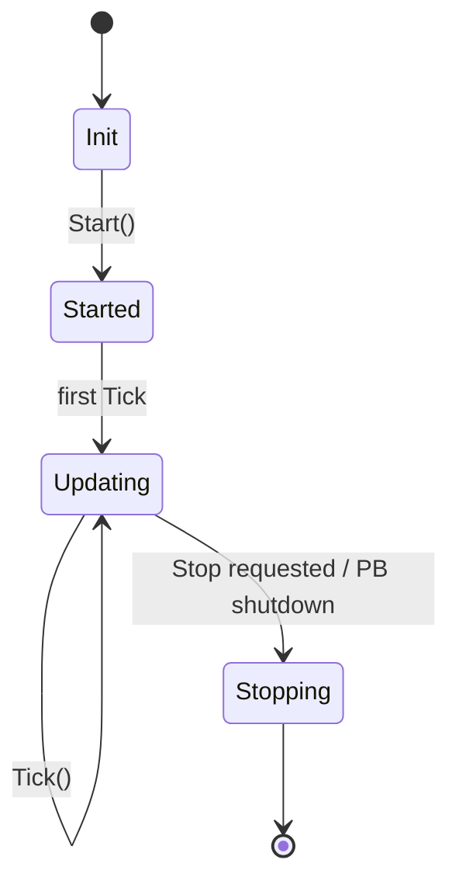

# VIOS — Viking Industries Operating System (SE/MDK²) — Architecture v0.1 (Naming Rule Applied)

> Target: **Space Engineers Programmable Block** (MDK²-SE), **netframework48**, **C# 6**, **VS Code**. All generated code (except `using`) must live inside `namespace IngameScript { partial class Program { /* … */ } }`.
>
> **Naming rule (added):** The operating system name **VIOS** must be uppercase in all **class/interface/struct** names (e.g., `VIOSKernel`, `IVIOSModule`, `VIOSPacket`, `VIOSContext`). Variables/fields may use lowercase `vios`.

---

## 1) Goals & Hard Constraints

* **SE/MDK²-SE**: Favor *VRage* APIs over general .NET where possible (e.g., `IMyTextSurface`, `MySprite`, `IMyIntergridCommunicationSystem`).
* **Safety**: Top-level `try/catch` around `Main()` tick driver; display errors on Debug LCD.
* **Ticks & Budgets**: Track **TIC** (`Runtime.CurrentInstructionCount`) and **Call Depth** (`Runtime.CurrentCallChainDepth`) and yield at configurable thresholds.
* **Coroutine-First**: Extensive coroutine/state-machine scheduling to spread work across ticks.
* **Pooling/Queuing**: Reuse buffers and objects aggressively; central pools for messages, packets, sprites, strings.
* **Events/Messages**: Unified EventBus & MessageRouter for local (host/LAN) and inter-grid (WAN via IGC) with unicast/multicast/broadcast.
* **Time & Cycles**: Record UTC (`DateTime.UtcNow`) per tick & per event.
* **Mixins**: Core lives in **Mixins/VIOS/**; PB scripts are thin bootstraps in **Scripts/**; user extensions in **Modules/**.
* **Naming**: **VIOS** uppercase in class/interface/struct names; variables may use lowercase `vios`.

---

## 2) Repository Layout (MDK²-SE multi-project)

```
<root>/
├─ Scripts/
│  ├─ VIOS.Bootstrap/              # Programmable Block Script (thin): Program.cs
│  │  └─ Program.cs                # Instantiates VIOS from Mixins
│  └─ <OtherProject>/
├─ Mixins/
│  └─ VIOS/
│     ├─ VIOS.cs                   # Kernel + composition root (partial Program wrapper)
│     ├─ Env.cs                    # Environment adapter (GTS, Me, Runtime, IGC)
│     ├─ Scheduler.cs              # Coroutine scheduler & yields
│     ├─ Events.cs                 # Events & handlers
│     ├─ Messaging.cs              # Router, address, packet, codecs
│     ├─ Pools.cs                  # Pooling infra
│     ├─ UI/Console.cs             # Debug/status console (IMyTextSurface)
│     ├─ UI/Widgets.cs             # Widgets: header/footer, spinner, progress, list, table, 2d-diagram
│     ├─ Storage.cs                # Save()/Load() + MyIni-based config
│     ├─ Modules.cs                # Module base + registry + callbacks
│     └─ Stats.cs                  # Counters, TIC, depth, per-tick timestamps
├─ Components/
│  ├─ Discovery/
│  ├─ Screen/
│  ├─ Network/
│  └─ ...
└─ Modules/
   ├─ Basic/
   │  ├─ Power/
   │  ├─ Oxygen/
   │  ├─ Hydrogen/
   │  ├─ BlockDiscovery/
   │  ├─ Conveyor/
   │  ├─ ScreenMgr/
   │  ├─ SpriteHUD/
   │  ├─ Door/
   │  ├─ Light/
   │  ├─ Sound/
   │  └─ Docking/
   └─ Complex/
      ├─ Airlock/
      ├─ Cargo/
      └─ Production/
```

> **Note:** In the compiled PB script, all types are nested inside `partial class Program`. Mixins supply source that the MDK packager merges into the final `Program.cs` under the `IngameScript` namespace.

---

## 3) Core Concepts & Interfaces

### 3.1 Environment & Bootstrap

* **Environment** abstracts `GridTerminalSystem`, `Echo`, `Me`, `Runtime`, `IGC`, default console/debug surfaces.
* **Bootstrap** (in PB `Program()`) wires *Environment → Kernel (VIOS)*, registers modules, sets initial `UpdateFrequency`.

```csharp
namespace IngameScript {
  partial class Program {
    // Minimal signatures (C# 6-friendly). Implementations live in Mixins.

    interface IVIOSKernel {
      void Init(IEnv env, IConfig config);
      void RegisterModule(IVIOSModule module);
      void Start(UpdateFrequency freq);
      void Tick(UpdateType type, string argument); // called from Main()
      void Save();
    }

    interface IEnv {
      IMyGridProgramRuntimeInfo Runtime { get; }
      IMyGridTerminalSystem GTS { get; }
      IMyProgrammableBlock Me { get; }
      IMyIntergridCommunicationSystem IGC { get; }
      Action<string> Echo { get; }
      IMyTextSurface Console { get; }
      List<IMyTextSurface> DebugSurfaces { get; }
      DateTime UtcNow { get; }
      void SetUpdateFrequency(UpdateFrequency f);
    }

    interface IConfig {
      int TicBudgetSoft { get; }    // e.g. 30_000
      int TicBudgetHard { get; }    // e.g. 45_000 -> force yield
      int CallDepthMax { get; }     // safety (e.g. 50)
      int QueueMax { get; }
      string NetworkTag { get; }    // e.g. "VIOS"
      // ... loaded from CustomData via MyIni
    }
  }
}
```

### 3.2 Scheduler & Coroutines

* **Single-threaded** cooperative multitasking via `IEnumerator<VIOSYield>`.
* **Yields**: `Now` (voluntary), `UntilTick`, `UntilTimeUtc`, `UntilEvent`, `UntilMessage`, `WaitForBlock`, etc.
* **Budget-aware**: scheduler stops when TIC ≥ soft limit or any time ≥ hard limit or depth beyond max.

```csharp
namespace IngameScript {
  partial class Program {
    struct VIOSYield {
      public int Kind;   // 0=Now,1=Tick,2=Time,3=Event,4=Message
      public long A;     // generic payload (e.g., targetTick, unixMs)
      public int B;      // aux
    }

    interface ICoroutine { bool Step(VIOSContext ctx, out VIOSYield next); }

    interface IScheduler {
      void Enqueue(ICoroutine c);
      int Pending { get; }
      void Tick(VIOSContext ctx); // advances while under TIC/call-depth budgets
    }

    struct VIOSContext {
      IEnv Env; IConfig Cfg; IEventBus Events; IMessageRouter Router; IStats Stats; IPools Pools;
    }
  }
}
```

### 3.3 Events & Messages

* **Events**: local, intra-host notifications (e.g., `Tick`, `Argument`, `BlockAdded`, `ConfigChanged`).
* **Messages**: addressable packets for unicast/multicast/broadcast across *Host → LAN → WAN (IGC)*.

```csharp
namespace IngameScript {
  partial class Program {
    struct Event { ushort Type; int A; int B; object Payload; DateTime Utc; UpdateType Source; }

    interface IEventBus {
      void Publish(ref Event e);
      void Subscribe(ushort type, IEventHandler h);
    }

    interface IEventHandler { void OnEvent(ref Event e, VIOSContext ctx); }

    struct VIOSAddress { byte Scope; string Host; string Module; ushort Endpoint; }
    struct VIOSPacket { VIOSAddress Src, Dst; ushort Kind; byte Ttl; int Seq; string Data; }

    interface IMessageRouter {
      void Unicast(ref VIOSPacket p);
      void Broadcast(ref VIOSPacket p, byte scope);       // host/lan/wan
      void Multicast(ref VIOSPacket p, string groupName); // logical groups
      void Pump(VIOSContext ctx); // poll IGC listeners + local queues
    }
  }
}
```

### 3.4 Pools & Queues

* **Object pools** for `Event`, `VIOSPacket`, `StringBuilder`, sprite lists, etc.
* **Queues**: ring-buffer style, configurable caps (drop oldest on overflow → metric).

```csharp
namespace IngameScript {
  partial class Program {
    interface IPool<T> { T Take(); void Return(T item); int Count { get; } }
    interface IPools { IPool<Event> Events { get; } IPool<VIOSPacket> Packets { get; } /* … */ }
  }
}
```

### 3.5 UI / Console / Widgets

* **Console**: Me’s surface (or dedicated LCD) with standardized **header + body + footer** (ship/station & block name, UTC ISO, status, stats).
* **Widgets**: spinner, progress, 2D diagram (sparklines), lists, tables.
* **Layouts** configurable via `CustomData` (compatible with **MMaster’s Automatic LCDs 2** style sections/keys).

```csharp
namespace IngameScript {
  partial class Program {
    interface IConsole { void WriteStatus(VIOSContext ctx); void Draw(VIOSContext ctx); }
    interface IWidget { void Render(IMyTextSurface s, ref MySpriteDrawFrame f, in WidgetData d); }
    struct WidgetData { /* layout rects, text, values */ }
  }
}
```

### 3.6 Storage & Config

* **Config** via `MyIni` in `Me.CustomData` (layout compatible with ALCDs2 sections).
* **Persistence** via PB `Storage` and optional `CustomData` snapshots.

```csharp
namespace IngameScript {
  partial class Program {
    interface IStorage { void Load(); void Save(); MyIni Ini { get; } }
  }
}
```

### 3.7 Modules (Extensible)

* **Lifecycle**: `Init` → `Start` → `Update/Tick` → `Stop`.
* **Capabilities**: register event handlers, coroutines, console widgets, and message endpoints.
* **Callbacks**: module-to-module interaction via typed callbacks or message RPC.

```csharp
namespace IngameScript {
  partial class Program {
    interface IVIOSModule {
      string Name { get; }
      void Init(VIOSContext ctx, IModuleRegistrar reg);
      void Start(VIOSContext ctx);
      void Tick(VIOSContext ctx); // light work; heavy work via coroutines
      void Stop(VIOSContext ctx);
      void OnMessage(ref VIOSPacket p, VIOSContext ctx);
      void DescribeStatus(StringBuilder sb); // for footer + debug
    }

    interface IModuleRegistrar {
      void OnEvent(ushort type, IEventHandler handler);
      void Endpoint(ushort endpointKind, IVIOSModule module);
      void Coroutine(ICoroutine c);
      void Widget(IWidget w);
    }
  }
}
```

---

## 4) Data Flow & Tick Pipeline

**Main() (PB) → Kernel.Tick():**

1. **Collect**: Update type, argument, UTC timestamp, TIC & call-depth snapshot.
2. **Guardrails**: Abort/early-yield if `Runtime.CurrentCallChainDepth` > `CallDepthMax`.
3. **Pump IGC**: `MessageRouter.Pump()` to collect incoming WAN/LAN packets (pooled) → enqueue local deliveries.
4. **Raise Events**: standard `Tick` + `Argument` events.
5. **Run Scheduler**: progress coroutines until **soft TIC** limit.
6. **Module Ticks**: `module.Tick()` (budgeted per-module micro-slices).
7. **UI/Console**: draw once per `Update10` (configurable) to keep TIC low.
8. **Defer Save**: on `Update100` or on-demand; flush pools.

---

## 5) Messaging & Addressing

* **Scopes**:

  * `0 = Host (localhost)` – delivery within this PB (in-process dispatch).
  * `1 = LAN (local mechanically/connector-linked grids)` – IGC broadcast with `NetworkTag` + group/cluster hints.
  * `2 = WAN (inter-grid, detached)` – IGC broadcast/unicast by PB entity ID.
* **Address**: `VIOSAddress { Scope, HostName, ModuleName, Endpoint }`.
* **Packet**: `VIOSPacket { Src, Dst, Kind, Ttl, Seq, Data }`; *Data* is a compact string (INI-like or delimited), avoiding heavy serializers.
* **Groups / Multicast**: Named lists maintained via discovery beacons; join/leave with broadcasts.
* **Name Service**: lightweight DNS-like registry: modules announce `Name → Address` on boot; queries are broadcast with exponential backoff.

---

## 6) UI Layout & Widgets

* **Header**: `<GridName>/<ShipName> :: <PB Name>    <UTC ISO>    <UpdateFreq>`
* **Body**: regioned grid for widgets (CustomData layout: rows/cols, spans).
* **Footer**: status line: `TIC:cur/soft/hard  Depth:cur/max  Q:msg/coro  Mod:<active>/<total>  Net:rx/tx`

Widgets include: **Spin**, **Progress**, **Sparkline(2D)**, **List**, **Table**, **Block Stats**.

---

## 7) Module Library (Base → Extensible)

**Basic Modules (inherit `VIOSModuleBase`)**

* **Power**: scanners for `IMyBatteryBlock`, `IMyReactor`, `IMySolarPanel`, `IMyHydrogenEngine`; expose producers/consumers; compute reserves.
* **Oxygen**/**Hydrogen**: `IMyGasGenerator`, tanks, O2/H2 farm stats.
* **Block Discovery**: indexed lookups by subtype/type; caching with dirty flags.
* **Conveyor**: graph traversal of conveyor network (lightweight; incremental via coroutine).
* **ScreenMgr**: multi-surface management; mosaic across connected surfaces.
* **SpriteHUD**: cockpit overlays with `DrawFrame` (when seated).
* **Door/Light/Sound/Docking**: declarative control via CustomData profiles & events.

**Complex Modules**

* **Airlock**: finite-state machine across paired doors, pressure sensors, indicators, interlock/callbacks.
* **Cargo**: inventory balancing, stock thresholds, pull/push jobs (queued coroutines).
* **Production**: assembler/refinery job queues, power-aware throttling.

---

## 8) Safety & Performance Strategy

* **Budgets**: soft TIC (cooperative yield), hard TIC (immediate stop of scheduler), max call depth.
* **Work Slicing**: large scans split into *chunks per tick* using enumerator coroutines.
* **Pooling**: fixed-size pools; on exhaustion, drop non-critical work and log once per N ticks.
* **Drawing Cadence**: at most once per `Update10` unless explicitly requested.
* **IGC Backpressure**: outbound queue caps; TTL decrement; drop & metric.

---

## 9) Minimal Code Skeleton (C# 6; **signatures only**) — *to be placed under* `IngameScript.Program`

```csharp
namespace IngameScript {
  partial class Program {
    // === Bootstrap ===
    IVIOSKernel _kernel; IEnv _env; IConfig _cfg;

    public Program() {
      // create env, cfg, kernel from Mixins (source-merged at build)
      _env = new Env(this); _cfg = new IniConfig(this); _kernel = new VIOSKernel();
      _kernel.Init(_env, _cfg);
      // register built-in modules
      _kernel.RegisterModule(new ModulePower());
      _kernel.RegisterModule(new ModuleScreen());
      // ... etc.
      _kernel.Start(UpdateFrequency.Update10 | UpdateFrequency.Update100);
    }

    public void Save() { _kernel.Save(); }

    public void Main(string argument, UpdateType updateSource) {
      try { _kernel.Tick(updateSource, argument); }
      catch (Exception ex) { Echo("VIOS ERROR: " + ex.Message); /* also draw to Debug */ }
    }

    // === Interfaces (see sections above for details) ===
    interface IVIOSKernel { void Init(IEnv env, IConfig cfg); void RegisterModule(IVIOSModule m); void Start(UpdateFrequency f); void Tick(UpdateType t, string arg); void Save(); }
    interface IEnv { IMyGridProgramRuntimeInfo Runtime { get; } IMyGridTerminalSystem GTS { get; } IMyProgrammableBlock Me { get; } IMyIntergridCommunicationSystem IGC { get; } Action<string> Echo { get; } IMyTextSurface Console { get; } List<IMyTextSurface> DebugSurfaces { get; } DateTime UtcNow { get; } void SetUpdateFrequency(UpdateFrequency f); }
    interface IConfig { int TicBudgetSoft { get; } int TicBudgetHard { get; } int CallDepthMax { get; } int QueueMax { get; } string NetworkTag { get; } }
    struct VIOSYield { public int Kind; public long A; public int B; }
    interface ICoroutine { bool Step(VIOSContext ctx, out VIOSYield next); }
    interface IScheduler { void Enqueue(ICoroutine c); int Pending { get; } void Tick(VIOSContext ctx); }
    struct Event { public ushort Type; public int A; public int B; public object Payload; public DateTime Utc; public UpdateType Source; }
    interface IEventBus { void Publish(ref Event e); void Subscribe(ushort type, IEventHandler h); }
    interface IEventHandler { void OnEvent(ref Event e, VIOSContext ctx); }
    struct VIOSAddress { public byte Scope; public string Host; public string Module; public ushort Endpoint; }
    struct VIOSPacket { public VIOSAddress Src, Dst; public ushort Kind; public byte Ttl; public int Seq; public string Data; }
    interface IMessageRouter { void Unicast(ref VIOSPacket p); void Broadcast(ref VIOSPacket p, byte scope); void Multicast(ref VIOSPacket p, string group); void Pump(VIOSContext ctx); }
    interface IPool<T> { T Take(); void Return(T item); int Count { get; } }
    interface IPools { IPool<Event> Events { get; } IPool<VIOSPacket> Packets { get; } }
    interface IConsole { void WriteStatus(VIOSContext ctx); void Draw(VIOSContext ctx); }
    interface IWidget { void Render(IMyTextSurface s, ref MySpriteDrawFrame f, ref WidgetData d); }
    struct WidgetData { /* layout */ }
    interface IStorage { void Load(); void Save(); MyIni Ini { get; } }
    interface IVIOSModule { string Name { get; } void Init(VIOSContext ctx, IModuleRegistrar reg); void Start(VIOSContext ctx); void Tick(VIOSContext ctx); void Stop(VIOSContext ctx); void OnMessage(ref VIOSPacket p, VIOSContext ctx); void DescribeStatus(StringBuilder sb); }
    interface IModuleRegistrar { void OnEvent(ushort type, IEventHandler handler); void Endpoint(ushort endpointKind, IVIOSModule module); void Coroutine(ICoroutine c); void Widget(IWidget w); }
    struct VIOSContext { public IEnv Env; public IConfig Cfg; public IEventBus Events; public IMessageRouter Router; public IStats Stats; public IPools Pools; }
    interface IStats { int TicNow { get; } int TicSoft { get; } int DepthNow { get; } int DepthMax { get; } int Coroutines { get; } int MsgQueued { get; } /* … */ }
    // ... concrete classes follow in Mixins; omitted here for brevity
  }
}
```

---

## 10) Architecture Diagrams (Mermaid)

> You can paste these into any Mermaid-compatible viewer.

### 10.1 Layered Overview

```mermaid
flowchart TD
  PB[Programmable Block Main()] -->|Bootstrap| Kernel
  subgraph VIOS Core
    Kernel[VIOS Kernel]
    Scheduler[Coroutine Scheduler]
    Events[EventBus]
    Router[MessageRouter/IGC]
    Pools[Object Pools]
    UI[Console & Widgets]
    Storage[Storage & Config]
    Stats[Stats & Telemetry]
  end
  Kernel --> Scheduler
  Kernel --> Events
  Kernel --> Router
  Kernel --> Pools
  Kernel --> UI
  Kernel --> Storage
  Kernel --> Stats
  subgraph Modules
    M1[Power]
    M2[ScreenMgr]
    M3[Oxygen]
    M4[Hydrogen]
    M5[Door]
    M6[Airlock]
    M7[Cargo]
    M8[Production]
  end
  Kernel -.register/start/stop.-> Modules
  Modules --> Events
  Modules --> Router
  UI -->|Draws to| LCD[IMyTextSurface(s)]
  Router --> IGC[IMyIntergridCommunicationSystem]
```

### 10.2 Class/Interface Diagram (key relationships)



### 10.3 Tick Pipeline (sequence)



### 10.4 Messaging Path (unicast)



### 10.5 Module Lifecycle (state machine)



---

## 11) CustomData (MyIni) Layout (example)

```ini
[VIOS]
UpdateFrequency=Update10,Update100
TIC.Soft=30000
TIC.Hard=45000
Depth.Max=50
Network.Tag=VIOS

[Console]
Surfaces=PB:0;LCD "Bridge Main":0
Draw.Cadence=Update10

[Modules]
Enable=Power,ScreenMgr,Oxygen,Hydrogen,Door,Airlock,Cargo,Production

[Airlock:Hangar]
OuterDoor=Door Hangar Out
InnerDoor=Door Hangar In
PressureSensor=Sensor Hangar
```

---

## 12) Extension Patterns

* **Callbacks**: module registers named callbacks with kernel. Other modules resolve by name and invoke.
* **RPC**: message `Kind=RPC` with `Endpoint` routing; response `Seq` parity for correlation.
* **Coroutine Library**: common coroutines for *block scans*, *inventory walks*, *graph traversals*.
* **Diagnostics**: `Stats` publishes rolling averages per 100 ticks; UI footer consumes.

---

## 13) Next Steps

1. Generate Mixins with concrete classes (`Env`, `VIOSKernel`, `Scheduler`, `Router`, etc.).
2. Add a **ScreenMgr** basic module to prove LCD/Widgets and budgets.
3. Add **Power** basic module to prove discovery/pooling and 2D diagrams.
4. Wire minimal **Name Service** broadcast and local registry.
5. Create MDK² **Mixin Projects** and a **PB Script** bootstrap project using the provided `csproj`.

---

## Appendix A: Naming-compliant Module Stubs / Templates

```csharp
namespace IngameScript
{
  partial class Program
  {
    // Base class using uppercase VIOS (preferred when branding)
    abstract class VIOSModuleBase : IVIOSModule
    {
      public abstract string Name { get; }
      public virtual void Init(VIOSContext ctx, IModuleRegistrar reg) { }
      public virtual void Start(VIOSContext ctx) { }
      public virtual void Tick(VIOSContext ctx) { }
      public virtual void Stop(VIOSContext ctx) { }
      public virtual void OnMessage(ref VIOSPacket p, VIOSContext ctx) { }
      public virtual void DescribeStatus(StringBuilder sb) { }
    }

    // Option A: Neutral module names (no OS name in class)
    class ModulePower : VIOSModuleBase
    {
      public override string Name { get { return "Power"; } }
      // add overrides as needed
    }

    class ModuleScreen : VIOSModuleBase
    {
      public override string Name { get { return "ScreenMgr"; } }
      // add overrides as needed
    }

    // Option B: Branded module names (include OS name, must use uppercase VIOS)
    class VIOSPowerModule : VIOSModuleBase
    {
      public override string Name { get { return "Power"; } }
    }

    class VIOSScreenModule : VIOSModuleBase
    {
      public override string Name { get { return "ScreenMgr"; } }
    }

    // Variables/fields may be lowercase 'vios'
    VIOSKernel _viosKernelRef;
  }
}
```

